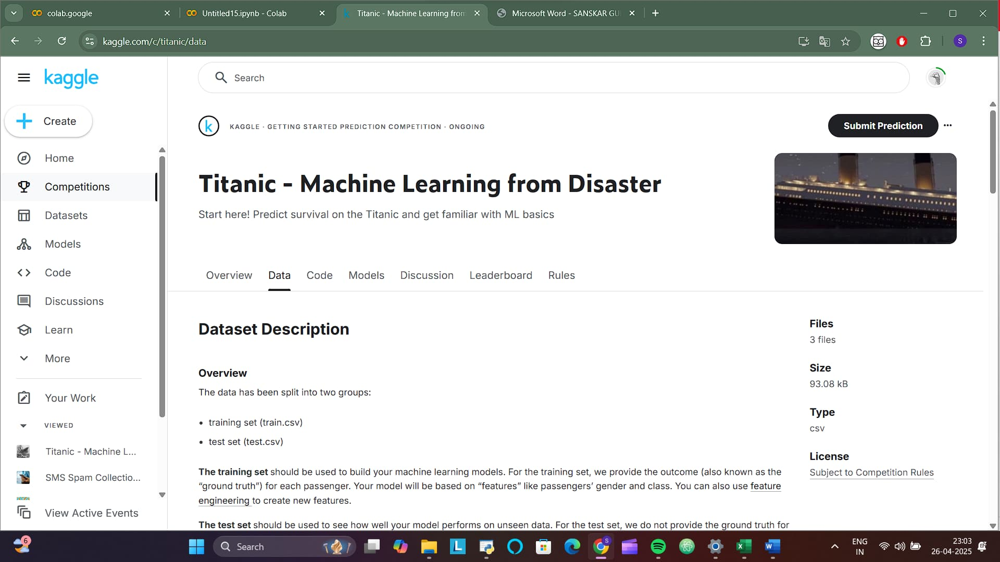
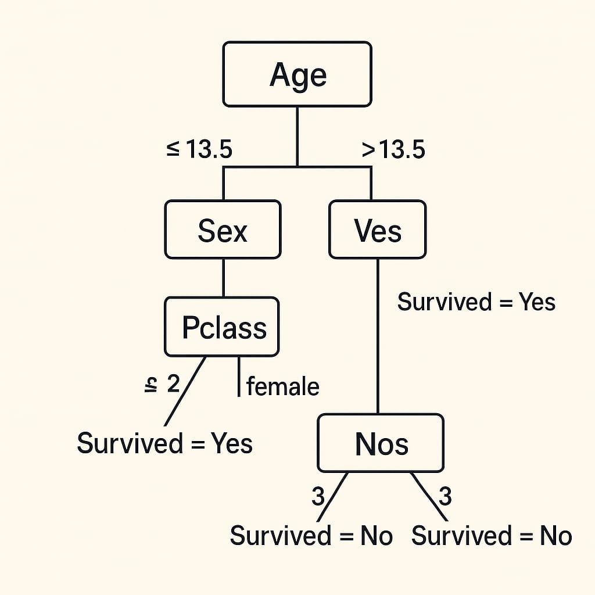
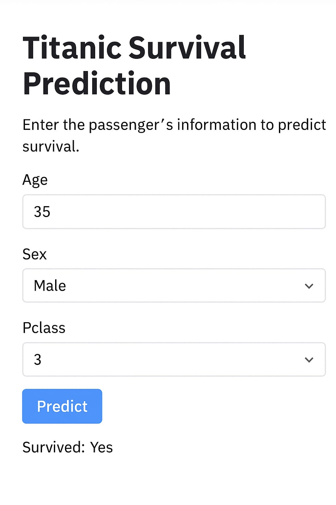
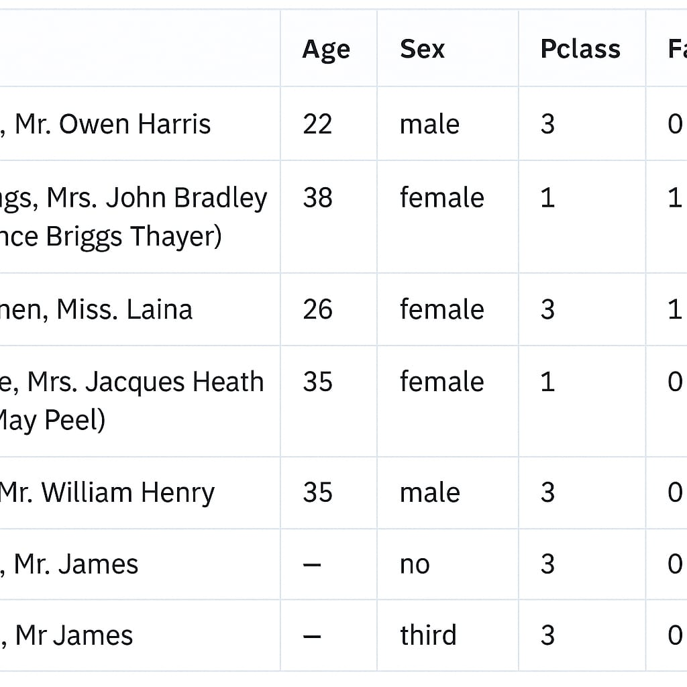

<h1 align="center">Titanic Survival Prediction</h1>

  

<h2>About the Project</h2>

This project predicts whether a passenger survived the Titanic shipwreck using a Decision Tree Classifier.
It includes clean visualizations and insights from the Titanic dataset.

<h2>Features Used for Prediction</h2>

<ul>
  <li>Pclass (Passenger Class)</li>
  <li>Sex</li>
  <li>Age</li>
  <li>SibSp (Number of siblings/spouses aboard)</li>
  <li>Parch (Number of parents/children aboard)</li>
  <li>Embarked (Port of Embarkation)</li>
</ul>

<strong>Fare</strong> was replaced with the average Fare for each Pclass to simplify inputs and still retain important information.

<h2>Dataset and Preprocessing</h2>

The Titanic dataset was prepared carefully by:
<ul>
  <li>Handling missing values</li>
  <li>Encoding categorical variables like Sex and Embarked</li>
  <li>Replacing missing Fare values based on the mean of each Pclass</li>
</ul>

<h2>Model Building</h2>

A Decision Tree Classifier was trained using Scikit-learn.
Model evaluation was done using accuracy and interpretability.
The trained model can predict survival based on user input features.

<h2>Future Improvements</h2>
<ul>
  <li>Use Random Forest or XGBoost for better accuracy</li>
  <li>Apply hyperparameter tuning (GridSearchCV)</li>
  <li>Enhance feature engineering techniques</li>
</ul>

<h2>Acknowledgements</h2>

Dataset: <a href="https://www.kaggle.com/competitions/titanic" target="_blank">Kaggle Titanic Competition</a>  
Libraries Used: Python, Pandas, Scikit-learn, Streamlit

<h2>Author</h2>

<strong>Sanskar Gupta</strong>  
<i>"Transforming Data into Insights, One Model at a Time"</i>

<h2 align="center">Project Visuals</h2>

<h3>Decision Tree Overview</h3>

  

<h3>Sample Streamlit App Interface</h3>

  

<h3>Sample Titanic Dataset Preview</h3>

  

